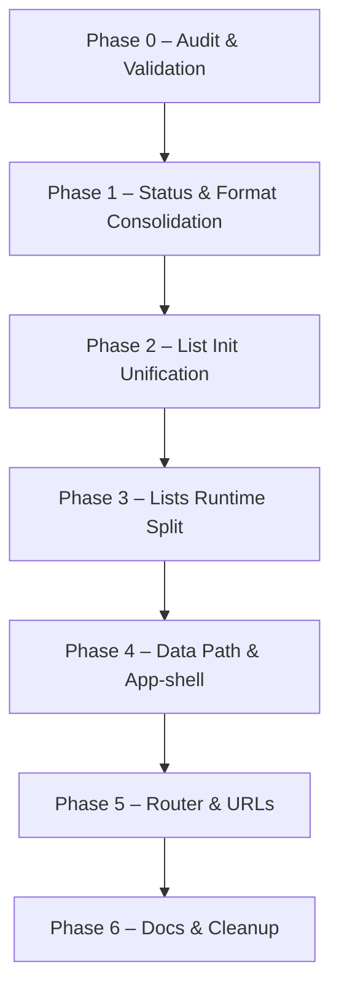

## Portal refactor – operational roadmap

**Scope:** `portal/` runtime and core architecture, list and entity flows, and their interaction with the Supabase backend.  
**Derived from:** `docs/portal-refactor-audit.md` and `docs/portal-workflow-database-audit.md`  
**Governed by:** `docs/portal-refactor-master-plan.md`

This roadmap turns the audit and master plan into a **concrete, file-level plan** for Phases 0–6. It is intentionally conservative: all changes must be behavior‑preserving unless a later phase explicitly calls out a functional change.

---

## 1. Current context snapshot (repo + runtime)

### 1.1 High-level structure (from audit)

- `core/` mixes infrastructure and heavy runtime logic:
  - Infrastructure: `router.js`, `supabase-client.js`, `supabase.js`, `auth.js`, `session-ready.js`, `session/`, `source-helpers.js`, `job-posting-deadline.js`, `debug.js`, `entity-toolbar.js`, `entity-page/*`, `data/*`, `ui/*`.  
  - Runtime-style logic: `core/lists-runtime.js` (dashboard + all list pages), some status and format helpers.
- `runtime/` contains page bootstrap and common UX/runtime modules:
  - `runtime/router-runtime.js` – page key detection + protected-page set.  
  - `runtime/page-bootstrap.js` – central orchestration (auth guard, profile, header, lists, forms, bottom nav).  
  - `runtime/status-runtime.js` – centralized status and availability helpers for candidates, applications, offers.  
  - Multiple per-page runtimes: `candidate-runtime.js`, `client-runtime.js`, `job-offer-runtime.js`, `job-posting-runtime.js`, `profile-runtime.js`, `candidate-profile-runtime.js`, `candidate-import-runtime.js`, etc.  
  - Other UX modules: `forms-runtime.js`, `modals-runtime.js`, `filter-drawer-runtime.js`, `associations-runtime.js`, `entity-actions-runtime.js`, `header-runtime.js`, `bottom-nav-runtime.js`, `global-header-actions-runtime.js`.
- `features/` holds entity-specific UI and configs (candidates, clients, job-offers, applications, archived, profile, external-submissions).
- `queries/` implements `IEQueries.*` over Supabase, used by entity configs and runtimes.

### 1.2 Bootstrap and router observations

- **Bootstrap ownership (page-bootstrap):**
  - `IEPageBootstrap.runDataViews(pageKey)` initializes:
    - `dashboard` → `IEListsRuntime.initDashboardPage()`  
    - `candidates` → `IEListsRuntime.initCandidatesPage()`  
    - `job-offers` → `IEListsRuntime.initJobOffersPage()`  
    - `applications` → `IEListsRuntime.initApplicationsPage()`  
    - `clients` → `IEListsRuntime.initClientsPage()`  
    - `profile` → `IEProfileRuntime.initProfileMyActivitySection()`  
  - There is **no `runDataViews` branch** for `job-postings` or `external-submissions`; these are handled separately.

- **Router coverage (router-runtime):**
  - Recognizes: `dashboard.html`, `candidates.html`, `applications.html`, `application.html`, `job-offers.html`, `job-postings.html`, `job-posting.html`, `clients.html`, `archived.html`, `add-candidate.html`, `job-offer.html`, `add-job-offer.html`, `add-client.html`, `profile.html/htm`, `settings.html/htm`, `candidate.html`, `index.html` (login).  
  - Does **not** have explicit cases for `external-submissions.html` or `external-submission.html`; they fall through to `pageKey === "unknown"`.  
  - `PROTECTED_PAGES` includes `job-postings`, `job-offers`, `applications`, `candidates`, `clients`, entity detail pages, `archived`, `profile`, `settings`, and `unknown`.

### 1.3 Status and formatter duplication

- **Status runtime:**
  - `runtime/status-runtime.js` centralizes:  
    - Candidate **profile** status normalization and badges.  
    - Application status normalization, labels, and badges.  
    - Job offer status normalization (`active` → `open`, `"in progress"` → `inprogress`) and badges.  
    - Availability computation from applications or explicit fields.
- **Duplicated or divergent logic:**
  - `core/entity-toolbar.js` has its own lifecycle‑oriented `normalizeStatus()` for offers (active/closed/archived) that does not fully align with `status-runtime`’s “open/inprogress/closed” model.  
  - List and feature modules implement local status helpers (applications, job-offer pipeline, external submissions).  
  - Multiple local `escapeHtml` and `formatDate` helpers exist across header runtime, global header actions, job-offer runtime, job-posting runtime, job-postings list runtime, external submissions features, and `core/lists-runtime.js`.

### 1.4 `core/lists-runtime.js` snapshot

- Single 3,600+ line module responsible for:
  - Dashboard data loading (`IESupabase` + `IEData.dashboard`) and card/table rendering.  
  - Filters, pagination, and table rendering for: candidates, job offers, clients, applications, and external submissions preview.  
  - Some status and date formatting, partially aligned with `status-runtime` but not consistently.  
- Classified in the audit as **SPLIT**: it should be broken into per-domain list runtimes and shared helpers under `runtime/`.

---

## 2. Phase sequence (0–6)

This roadmap implements exactly the phase sequence described in section F of `docs/portal-refactor-audit.md`, with additional file-level detail.

### Phase 0 – Audit validation gate (already executed conceptually)

- **Objective:** Confirm that:
  - The working tree matches the structure and behavior described in the audit.  
  - This roadmap and the master plan exist in `docs/` and are consistent with the audit.  
  - No unexpected changes have occurred in critical runtime/core files.
- **Files to inspect:**
  - `docs/portal-refactor-audit.md`  
  - `docs/portal-workflow-database-audit.md`  
  - `docs/portal-refactor-master-plan.md`  
  - `docs/portal-refactor-roadmap.md`  
  - `portal/runtime/page-bootstrap.js`  
  - `portal/runtime/router-runtime.js`  
  - `portal/runtime/status-runtime.js`  
  - `portal/core/lists-runtime.js`  
  - Other supporting docs as needed.
- **Exit criteria:**  
  - Governance docs present and coherent.  
  - No mismatch between repo structure and the architecture assumptions in the audit.  
  - GO or NO-GO for Phase 1 recorded in `docs/portal-refactor-execution-log.md`.

### Phase 1 – Status and formatter consolidation

- **Goal:** Centralize status, badge, and label helpers plus shared formatting utilities without changing routing or page bootstrap behavior.
- **Primary in-scope files:**
  - `portal/runtime/status-runtime.js`  
  - `portal/core/entity-toolbar.js`  
  - `portal/core/lists-runtime.js` (status/label usage only)  
  - `portal/runtime/job-offer-runtime.js`  
  - `portal/features/job-offers/job-offer-entity-config.js` (pipeline status/labels)  
  - `portal/features/applications/application.js`  
  - `portal/features/applications/application-detail.js`  
  - `portal/features/applications/applications.js`  
  - `portal/queries/applications.queries.js`  
  - `portal/features/external-submissions/external-submissions-list.js`  
  - `portal/features/external-submissions/external-submission.js`  
  - `portal/features/external-submissions/external-submission-formatters.js`  
  - `portal/runtime/header-runtime.js` and `portal/runtime/global-header-actions-runtime.js` (for shared `escapeHtml`/date formatting).
- **Key operations (high-level):**
  - Extend `IEStatusRuntime` to cover any missing, portal-wide status semantics (e.g. external submission statuses) where appropriate.  
  - Replace ad-hoc status normalization/label/badge helpers in lists, pipelines, and features with calls into `IEStatusRuntime`.  
  - Introduce a shared formatter module (or small set of helpers) for `formatDate` and `escapeHtml`, used by lists, external-submissions features, and header components.  
  - Keep routing, bootstrap sequence, and file locations unchanged.

### Phase 2 – List initialization unification (bootstrap-owned)

- **Goal:** Make `IEPageBootstrap.runDataViews(pageKey)` the **single entrypoint** for list initialization.
- **Primary in-scope files:**
  - `portal/runtime/page-bootstrap.js`  
  - `portal/runtime/job-postings-list-runtime.js`  
  - `portal/features/external-submissions/external-submissions-list.js` (if unified under bootstrap)  
  - `portal/runtime/router-runtime.js` (for page-key coverage of external submissions, if/when brought under bootstrap).
- **Key operations (high-level):**
  - Factor the core list init for job-postings into a function that can be called both from `job-postings-list-runtime.js` and `runDataViews("job-postings")`, then **add a `job-postings` branch** to `runDataViews`.  
  - Optionally, for external submissions, add a page-key case in `router-runtime` and a corresponding branch in `runDataViews` that calls the external-submissions list initializer.  
  - Avoid double-initialization by ensuring that per-page list runtimes either delegate to a shared init function or become thin wrappers called only via bootstrap.

### Phase 3 – Lists runtime split (move from core → runtime)

- **Goal:** Split `core/lists-runtime.js` into smaller, clearer modules while preserving behavior.
- **Primary in-scope files:**
  - `portal/core/lists-runtime.js` (source of truth to be split)  
  - New files under `portal/runtime/lists/`, e.g.:  
    - `runtime/lists/dashboard.js`  
    - `runtime/lists/candidates-list.js`  
    - `runtime/lists/job-offers-list.js`  
    - `runtime/lists/clients-list.js`  
    - `runtime/lists/applications-list.js`  
    - `runtime/lists/shared-list-helpers.js`
  - Any HTML entry points that load the list scripts (to ensure script order is preserved).
- **Key operations (high-level):**
  - Extract dashboard logic into `runtime/lists/dashboard.js` and call it from a thin `IEListsRuntime.initDashboardPage` facade.  
  - Extract each list’s init + render logic into its own file, reusing a shared helpers module for filters, table row creation, badges, and date formatting.  
  - Keep the global surface `window.IEListsRuntime.init*Page` intact so `page-bootstrap` and existing templates remain unchanged.

### Phase 4 – Data path and app-shell simplification

- **Goal:** Simplify `core/app-shell.js` and make application data flows consistent with the validated database model.
- **Primary in-scope files:**
  - `portal/core/app-shell.js`  
  - `portal/core/data/applications.js`  
  - `portal/features/applications/application-entity-config.js`  
  - `portal/queries/applications.queries.js`  
  - Any related modules that currently call raw Supabase client methods for application updates.
- **Key operations (high-level):**
  - Introduce or align `IEData.applications`/`IEQueries.applications` so application save/update flows are cohesive and go through a small number of well-documented entry points.  
  - Replace raw `supabase.from('candidate_job_associations').update(...)` in entity configs with calls to the shared data layer.  
  - Trim `app-shell` down to auth guard, bootstrap helpers, and global wiring; move any residual list or status code out into runtime modules created in earlier phases.

### Phase 5 – Router, URLs, and navigation consistency

- **Goal:** Make routing, page keys, and URL construction consistent and maintainable.
- **Primary in-scope files:**
  - `portal/runtime/router-runtime.js`  
  - `portal/core/router.js`  
  - `portal/core/entity-toolbar.js`  
  - Entity configs under `portal/features/*-entity-config.js` that define `getViewUrl` / `getEditUrl`.  
  - `portal/runtime/header-runtime.js` and layout templates where needed.
- **Key operations (high-level):**
  - Decide and implement whether `external-submissions` becomes an explicit page key and, if so, wire it through router-runtime, bootstrap, and header/breadcrumbs.  
  - Centralize URL building for entity view/edit into a small set of helpers (e.g. `IEToolbar.getEntityViewUrl`) and have entity configs delegate to them.  
  - Remove routing inconsistencies (e.g. `jobOffer` vs `job-offer`) and ensure cross-module agreement on entity type names and paths.

### Phase 6 – Docs and cleanup

- **Goal:** Align documentation and remove unreachable legacy paths.
- **Primary in-scope files and folders:**
  - `docs/portal-refactor-audit.md`  
  - `docs/portal-workflow-database-audit.md`  
  - `docs/portal-refactor-master-plan.md`  
  - `docs/portal-refactor-roadmap.md`  
  - Other `portal/docs/*.md` that are superseded or partially duplicated.  
  - Legacy initialization code paths in runtimes that are no longer reachable.
- **Key operations (high-level):**
  - Create an explicit `docs/archive/` (or equivalent) for deprecated design documents.  
  - Ensure that the audit, master plan, and roadmap match the actual post‑refactor architecture.  
  - Remove unused legacy fallbacks once tests confirm that all entry points use the new paths.

---

## 3. Mermaid phase dependency diagram

The following diagram shows the dependency ordering between phases:

Interpretation:

- Later phases may **prepare** code that earlier phases touched, but they **must not** retroactively change the intent of a completed phase without recording that change in `docs/portal-refactor-execution-log.md`.  
- If a phase cannot be completed safely without partial work from a later phase, that dependency should be documented explicitly in the execution log and, if structural, reflected in an updated roadmap.

---

## 4. In-scope files list (governance view)

This section summarizes the core files that the roadmap expects to evolve across phases. It is not exhaustive of every helper, but it defines the main surfaces that should be considered “in play” for refactor work.

- **Bootstrap and routing**
  - `portal/runtime/page-bootstrap.js`  
  - `portal/runtime/router-runtime.js`  
  - `portal/core/router.js`

- **Status and shared formatters**
  - `portal/runtime/status-runtime.js`  
  - `portal/core/entity-toolbar.js`  
  - `portal/runtime/header-runtime.js`  
  - `portal/runtime/global-header-actions-runtime.js`  
  - `portal/core/lists-runtime.js` (status/date/escape helpers and their call sites)  
  - `portal/runtime/job-offer-runtime.js`  
  - `portal/features/job-offers/job-offer-entity-config.js`  
  - `portal/features/applications/*` (application, application-detail, applications list)  
  - `portal/queries/applications.queries.js`  
  - `portal/features/external-submissions/*`

- **Lists and dashboard**
  - `portal/core/lists-runtime.js` (source module to be split)  
  - New `portal/runtime/lists/*` modules introduced in Phase 3.

- **Data layer and app-shell**
  - `portal/core/app-shell.js`  
  - `portal/core/supabase.js`  
  - `portal/core/data/*` (especially `applications.js` and `dashboard.js`)  
  - `portal/queries/*.queries.js`

- **Documentation and governance**
  - `docs/portal-refactor-audit.md`  
  - `docs/portal-workflow-database-audit.md`  
  - `docs/portal-refactor-master-plan.md`  
  - `docs/portal-refactor-roadmap.md`  
  - `docs/portal-refactor-execution-log.md`

This list is intended to be used as a **scope checklist** when planning or reviewing a phase: changes to these files should map directly back to the phases and intent described in the master plan and the audit.

---

## 5. Validation guidance for Phase 1 GO/NO-GO

To decide whether Phase 1 is ready to start (after this roadmap and the master plan are present):

1. **Confirm governance presence**  
   - `docs/portal-refactor-master-plan.md` exists and describes phases 0–6, goals, and architecture intentions.  
   - This roadmap exists and is consistent with the audit’s proposed phases and target architecture.

2. **Confirm runtime shape**  
   - `portal/runtime/page-bootstrap.js` list initialization behavior matches the audit (no job-postings or external-submissions branch yet).  
   - `portal/runtime/router-runtime.js` page-key handling is unchanged from the audit (external submissions still map to `unknown`).  
   - `portal/runtime/status-runtime.js` remains the central status helper module without unexpected new responsibilities.  
   - `portal/core/lists-runtime.js` is still a single monolithic lists/dashboard runtime.

3. **Confirm no new blockers**  
   - No new divergence between database behavior and the workflow/database audit.  
   - No structural changes to bootstrapping, routing, or status logic that would invalidate the Phase 1 plan.

If all of the above hold, the Phase 0 gate may return **GO for Phase 1**, with Phase 1 scope defined as “status runtime consolidation + shared formatters runtime,” as captured in the master plan and in the execution log.

